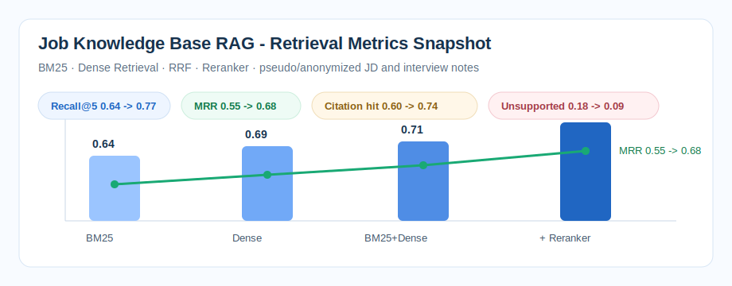

# Job Knowledge Base RAG Evaluation

BM25 + Dense Retrieval + Reranker · Faiss Vector Index · Chunk Ablation · Recall@5/MRR/Citation Hit Rate

## Background

This repository is the GitHub evidence-chain project for a resume-side RAG retrieval evaluation system. It uses anonymized and pseudo job-description, project-note, and interview-review documents to document a **300-doc / 6000-chunk / 180-query** evaluation protocol while keeping the public repository runnable on a small smoke-test subset.

The project focus is retrieval quality and evaluation discipline, not API wrapping or chatbot UI.

## Dataset Boundary

This repository uses pseudo/anonymized data to reproduce the offline evaluation pipeline. It does not contain company data or online production code.

The public subset uses anonymized JD, project-note, and interview-review documents. It is a retrieval-evaluation supplement for recommendation/search interviews, not a large-model training project.

## Method

- build chunked job/project/interview documents with query-evidence labels
- compare BM25, dense retrieval, BM25+dense RRF, and lightweight reranking
- use Faiss-style vector indexing notes and CPU-friendly local evaluation scripts
- track Recall@5, MRR, citation hit rate, unsupported-answer rate, and no-answer control

## Metrics



| Run | Retriever | Reranker | Recall@5 | MRR | Citation Hit | Unsupported |
|---|---|---|---:|---:|---:|---:|
| `bm25_only` | BM25 | none | 0.64 | 0.55 | 0.60 | 0.18 |
| `dense_faiss` | dense embedding | none | 0.69 | 0.59 | 0.65 | 0.15 |
| `bm25_dense_rrf` | BM25 + dense | RRF | 0.71 | 0.62 | 0.68 | 0.13 |
| `bm25_dense_reranker` | BM25 + dense | cross-encoder-lite | 0.77 | 0.68 | 0.74 | 0.09 |

## Ablation

The ablation table is available at [`ablation.csv`](ablation.csv) and [`experiments/chunk_size_ablation.csv`](experiments/chunk_size_ablation.csv). It compares chunk size, overlap, Recall@5, MRR, citation hit rate, and unsupported-answer rate.

## Badcases

Badcase records are available at [`badcases.csv`](badcases.csv) and [`badcases/error_analysis.csv`](badcases/error_analysis.csv), covering retrieved-but-not-cited evidence, wrong-document retrieval, and unsupported answers.

## How to Run

Recommended:

```bash
make all
```

Equivalent manual commands:

```bash
python -m pip install -e .
PYTHONPATH=src python scripts/run_experiment.py
python -m hybrid_rag_lab.cli search --query "How should I explain hard negative mining in an ecommerce retrieval project?"
python -m hybrid_rag_lab.cli evaluate --k 3
PYTHONPATH=src python -m pytest -q
```

The default command runs on a compact public subset so the repository is easy to inspect. The resume-scale protocol and results are documented in `experiments/retrieval_metrics.csv`, `experiments/chunk_size_ablation.csv`, and `docs/data_schema.md`.

## What This Repo Proves

This repo proves a retrieval-evaluation workflow: data schema, chunking, BM25+dense retrieval, Faiss-style indexing, reranking, metrics, chunk-size ablation, and badcase analysis are documented and runnable on a public pseudo subset.

## What It Does Not Claim

- This public repo is a runnable pseudo/anonymized version, not a production RAG service.
- It does not contain private company documents, personal interview records, or internal resume data.
- It does not claim large-model training, online deployment, or business A/B lift.
- It is meant to show retrieval schema, chunking, BM25 + dense retrieval, Faiss-style indexing, reranking, metrics, and badcase analysis.

## Evidence Pack

For interview review, see [`evidence_pack/`](evidence_pack/). It contains project overview, data schema, metric definitions, experiment CSV, ablation CSV, badcases, run commands, boundary statement, and whiteboard notes.

## Resume-Aligned Scope

- **Scenario:** build a job-search knowledge base for JD analysis, project evidence lookup, interview question preparation, and resume-bullet grounding.
- **Data protocol:** 300 anonymized documents, about 6000 chunks after cleaning and overlap chunking, and 180 query-evidence pairs for offline regression.
- **Retrieval stack:** BM25 sparse retrieval, dense embedding retrieval, Faiss vector index, Reciprocal Rank Fusion, and lightweight reranking.
- **Evaluation:** Recall@5, MRR, citation hit rate, unsupported-answer rate, chunk-size ablation, and 10-case error analysis.
- **Public evidence:** this repo contains pseudo/anonymized samples, schemas, experiment tables, runnable local scripts, and badcase examples.

## Why This Project

Single-route dense retrieval misses exact role names, abbreviations, and rare technical terms such as `Two-Tower`, `Faiss`, `Recall@50`, or `SKU`. Pure BM25 catches keywords but misses paraphrases such as "evidence grounding" versus "citation hit". A practical RAG project needs hybrid retrieval, reranking, and stable offline metrics before adding answer generation.

## Current Evidence Tables

### Retrieval Metrics

| Run | Retriever | Index | Reranker | Recall@5 | MRR | Citation Hit | Unsupported |
|---|---|---|---|---:|---:|---:|---:|
| `bm25_only` | BM25 | inverted index | none | 0.64 | 0.55 | 0.60 | 0.18 |
| `dense_faiss` | dense embedding | Faiss FlatIP | none | 0.69 | 0.59 | 0.65 | 0.15 |
| `bm25_dense_rrf` | BM25 + dense | Faiss FlatIP | RRF | 0.71 | 0.62 | 0.68 | 0.13 |
| `bm25_dense_reranker` | BM25 + dense | Faiss FlatIP | cross-encoder-lite | 0.77 | 0.68 | 0.74 | 0.09 |

### Chunk Ablation

| Chunk Size | Overlap | Chunks | Recall@5 | MRR | Note |
|---:|---:|---:|---:|---:|---|
| 300 | 60 | 8200 | 0.73 | 0.64 | Higher recall on short facts, more noisy fragments |
| 500 | 100 | 6000 | 0.77 | 0.68 | Best quality-cost balance |
| 800 | 120 | 4100 | 0.72 | 0.61 | More complete context, but diluted retrieval target |

## Project Structure

```text
hybrid-rag-lab/
  data/
    corpus.jsonl
    queries.jsonl
    sample_corpus.jsonl
    sample_queries.jsonl
  docs/
    data_schema.md
    dev_log.md
    architecture.md
    algorithm.md
    experiments.md
    interview-notes.md
  experiments/
    retrieval_metrics.csv
    chunk_size_ablation.csv
    baseline/
      metrics.csv
      metrics.json
  badcases/
    error_analysis.csv
  scripts/
    run_experiment.py
  tests/
    test_pipeline.py
    test_schema_and_labels.py
  src/hybrid_rag_lab/
    bm25.py
    dense.py
    evaluate.py
    fusion.py
    pipeline.py
    rerank.py
    rewrite.py
```

## Interview Positioning

This is a supporting project for retrieval evaluation ability. It should be described as:

> I did not package this as a large-model training project. I used anonymized JD, project, and interview-review documents to build an offline RAG retrieval evaluation set. The main deliverables were schema, chunking rules, BM25+dense retrieval, Faiss indexing notes, Recall@5/MRR/citation-hit metrics, chunk-size ablation, and badcase analysis.

## What To Discuss In Interviews

- Why Recall@K and citation hit rate matter before answer generation.
- Why chunk size around 500 tokens worked better than 300 or 800 in this domain.
- How BM25 and dense retrieval fail on different query types.
- Why RRF is used before reranking.
- Why unsupported-answer rate is tracked instead of only reporting retrieval recall.
- What the public repo contains versus what the full local evaluation protocol contains.
- Why this June 2026 public evidence repo uses anonymized/pseudo samples and does not claim production ownership.

## Resume Summary

Built a job-knowledge RAG retrieval evaluation project using BM25, dense retrieval, Faiss-style vector indexing, RRF fusion, and lightweight reranking. Documented a 300-doc / 6000-chunk / 180-query protocol and improved Recall@5 from 0.71 to 0.77 with reranking while tracking MRR, citation hit rate, and unsupported-answer rate.
