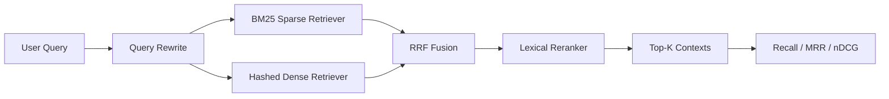

# Architecture

## System Goal

Hybrid RAG Lab separates retrieval quality optimization from answer generation. The first milestone is to build a measurable retrieval pipeline before adding an LLM generator.

## Pipeline

## Modules

| Module | File | Responsibility |
|---|---|---|
| Data loader | `src/hybrid_rag_lab/data.py` | Load corpus and labeled queries from JSONL |
| Tokenization | `src/hybrid_rag_lab/text.py` | Normalize text and build token features |
| Sparse retrieval | `src/hybrid_rag_lab/bm25.py` | Score documents using BM25 |
| Dense retrieval | `src/hybrid_rag_lab/dense.py` | Build deterministic dense-style hashed vectors |
| Query rewrite | `src/hybrid_rag_lab/rewrite.py` | Expand query routes with synonyms and normalized forms |
| Fusion | `src/hybrid_rag_lab/fusion.py` | Merge retriever rankings with Reciprocal Rank Fusion |
| Reranking | `src/hybrid_rag_lab/rerank.py` | Rescore candidates with query coverage and title overlap |
| Evaluation | `src/hybrid_rag_lab/evaluate.py` | Compute Recall@K, MRR@K, and nDCG@K |
| CLI | `src/hybrid_rag_lab/cli.py` | Run search and evaluation commands |

## Engineering Decisions

- No external LLM API is required in the first version, so retrieval experiments are reproducible.
- The dense retriever uses deterministic hashing as a local baseline. It can later be replaced by sentence-transformer embeddings and FAISS.
- RRF is used because it is simple, robust, and does not require score calibration across retrievers.
- Reranking is separated from first-stage retrieval to match production search architecture.

